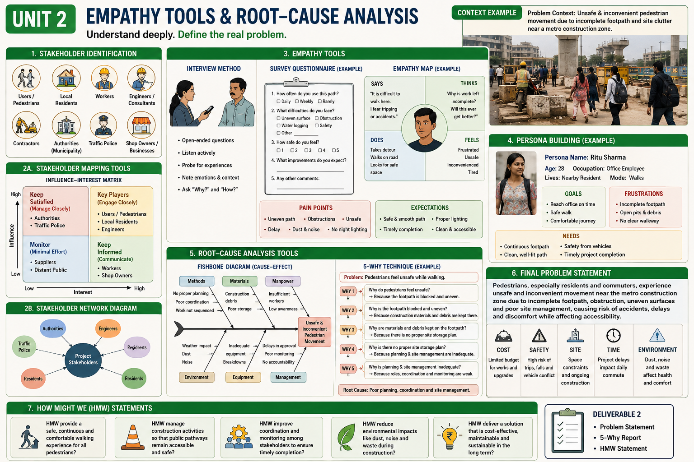

# Unit 2: Empathy Tools & Root-Cause Analysis

[Stakeholder identification in civil projects](#3-stakeholder-identification-in-civil-projects); [stakeholder mapping tools](#4-stakeholder-mapping-tools); [empathy tools](#5-empathy-tools); [empathy mapping and persona building](#6-empathy-mapping-and-persona-building); [identification of user pain points and expectations](#7-identification-of-user-pain-points-and-expectations); [root-cause analysis tools](#8-root-cause-analysis-tools); [writing a final problem statement with constraints](#9-writing-the-final-problem-statement); [framing How Might We HMW statements](#10-framing-how-might-we-hmw-statements)

* [Overview](#unit-overview)
* [Learning Objectives](#1-learning-objectives)
* [Introduction](#2-introduction)
* [Stakeholder Identification in Civil Projects](#3-stakeholder-identification-in-civil-projects)
  * [Users, Residents, Workers, Engineers, Contractors and Authorities](#31-users-residents-workers-engineers-contractors-and-authorities)
* [Stakeholder Mapping Tools](#4-stakeholder-mapping-tools)
  * [Influence–Interest Matrix](#41-influenceinterest-matrix)
  * [Stakeholder Network Diagram](#42-stakeholder-network-diagram)
* [Empathy Tools](#5-empathy-tools)
  * [Interview Method](#51-interview-method)
  * [Survey Questionnaire Preparation](#52-survey-questionnaire-preparation)
* [Empathy Mapping and Persona Building](#6-empathy-mapping-and-persona-building)
  * [Empathy Mapping](#61-empathy-mapping)
  * [Persona Building](#62-persona-building)
* [Identification of User Pain Points and Expectations](#7-identification-of-user-pain-points-and-expectations)
  * [User Pain Points](#71-user-pain-points)
  * [User Expectations](#72-user-expectations)
* [Root-Cause Analysis Tools](#8-root-cause-analysis-tools)
  * [Fishbone Diagram](#81-fishbone-diagram)
  * [5-Why Technique](#82-5-why-technique)
* [Writing the Final Problem Statement](#9-writing-the-final-problem-statement)
  * [Cost Constraints](#91-cost-constraints)
  * [Safety Constraints](#92-safety-constraints)
  * [Site Constraints](#93-site-constraints)
  * [Time Constraints](#94-time-constraints)
  * [Environmental Constraints](#95-environmental-constraints)
  * [Final Problem Statement](#96-final-problem-statement)
* [Framing How Might We HMW Statements](#10-framing-how-might-we-hmw-statements)
* [Unit 2 Activity](#11-unit-2-activity)
* [Unit 2 Deliverable](#12-unit-2-deliverable)
* [Key Takeaway](#13-key-takeaway)

## Overview

## 1. Learning Objectives

After completing this unit, students should be able to:

* Identify relevant stakeholders associated with a civil engineering problem.
* Recognise the roles and perspectives of **users, residents, workers, engineers, contractors, authorities and other stakeholders**.
* Apply stakeholder mapping tools such as the **Influence–Interest Matrix** and **Stakeholder Network Diagram**.
* Use empathy tools, including **interviews and survey questionnaires**, to understand users and stakeholders.
* Prepare an **empathy map** and develop an evidence-based **persona**.
* Identify user **pain points and expectations** from field observations and stakeholder interactions.
* Apply **Fishbone Diagrams** and the **5-Why technique** for root-cause analysis.
* Develop a clear, specific and solution-neutral **final problem statement**.
* Incorporate **cost, safety, site, time and environmental constraints** into problem definition.
* Frame suitable **How Might We (HMW)** statements for the subsequent ideation stage.

## 2. Introduction

In Unit 1, students learned how to identify a real civil engineering problem through **field observation, photographs, sketches, notes and basic measurements**.

However, an observed problem is not necessarily the complete problem.

A civil engineering problem may affect different stakeholders in different ways. For example, waterlogging near a college entrance may be inconvenient for students, a safety concern for pedestrians, a maintenance issue for facility staff, a traffic problem for security personnel and a technical concern for engineers.

Therefore, before developing a solution, students need to understand:

* **Who is affected?**
* **What difficulties do they experience?**
* **What do they need and expect?**
* **Who influences the problem or its resolution?**
* **What are the underlying causes?**
* **What constraints must be considered?**

Unit 2 develops these skills through the following sequence:

**Stakeholders → Stakeholder Mapping → Empathy Tools → Empathy Mapping & Persona → Pain Points & Expectations → Root-Cause Analysis → Final Problem Statement → HMW**

The objective is to move from an **initially observed problem** towards a **well-understood and clearly defined design opportunity**.

# 3. Stakeholder Identification in Civil Projects

A civil engineering project rarely involves only the person who directly experiences the problem.

A **stakeholder** is a person, group, organisation or authority that is affected by a civil engineering problem or project, has an interest in it, or can influence its planning, implementation, operation or maintenance.

Stakeholders should therefore be identified before developing a solution.

## 3.1 Users, Residents, Workers, Engineers, Contractors and Authorities

Depending on the problem, stakeholders may include:

* Users
* Residents
* Students
* Pedestrians
* Workers
* Engineers
* Architects
* Contractors
* Project managers
* Maintenance personnel
* Building owners
* Facility managers
* Government authorities
* Regulatory agencies
* Local communities

### Civil Engineering Example: Campus Waterlogging

Consider recurring waterlogging near a college entrance.

| Stakeholder            | Possible Concern                          |
| ---------------------- | ----------------------------------------- |
| Students               | Safe and convenient movement              |
| Faculty and staff      | Access to academic buildings              |
| Pedestrians            | Safe crossing and walking conditions      |
| Security personnel     | Traffic and crowd management              |
| Drivers                | Smooth vehicle movement                   |
| Maintenance staff      | Cleaning and maintenance of drainage      |
| Engineers              | Technical feasibility                     |
| Contractor             | Constructability and cost                 |
| College administration | Budget and implementation                 |
| Local authority        | Drainage and regulatory requirements      |
| Nearby residents       | Access and local environmental conditions |

The same physical problem can therefore have **different impacts and expectations for different stakeholders**.

### Questions for Stakeholder Identification

Students should ask:

* Who directly experiences the problem?
* Who uses the affected facility or space?
* Who lives or works nearby?
* Who operates or maintains the facility?
* Who designs or constructs it?
* Who makes decisions?
* Who provides funding?
* Who regulates or approves the work?
* Who may be indirectly affected?

> **Identify stakeholders from the complete project ecosystem, not only from the engineering perspective.**

# 4. Stakeholder Mapping Tools

After identifying stakeholders, the next step is to understand their **influence, interest and relationships**.

Two useful stakeholder mapping tools are:

1. **Influence–Interest Matrix**
2. **Stakeholder Network Diagram**

## 4.1 Influence–Interest Matrix

The **Influence–Interest Matrix** classifies stakeholders according to:

* **Influence:** The ability of a stakeholder to affect decisions or project outcomes.
* **Interest:** The level of concern or involvement a stakeholder has in the problem.

A basic matrix can be represented as:

|                    | Low Interest   | High Interest  |
| ------------------ | -------------- | -------------- |
| **High Influence** | Keep Satisfied | Manage Closely |
| **Low Influence**  | Monitor        | Keep Informed  |

### Civil Engineering Example

For a **campus drainage problem**:

| Stakeholder            | Influence  | Interest    |
| ---------------------- | ---------- | ----------- |
| College administration | High       | High        |
| Maintenance department | High       | High        |
| Students               | Low        | High        |
| Faculty                | Medium     | High        |
| Contractor             | High       | Medium/High |
| Nearby residents       | Low/Medium | Medium/High |
| Local authority        | High       | Medium      |

The matrix helps the team determine:

* Which stakeholders should be consulted closely.
* Which stakeholders should be kept informed.
* Whose concerns may influence the project.
* Whose experiences may provide important user insights.

> **Influence does not necessarily mean importance. A stakeholder with low formal influence may have high interest and valuable information about the problem.**

## 4.2 Stakeholder Network Diagram

A **Stakeholder Network Diagram** shows how stakeholders are connected to one another.

For example, a construction project may involve:

**Owner ↔ Engineer ↔ Contractor ↔ Workers**

while:

**Contractor ↔ Supplier**

**Owner ↔ Authority**

**Nearby Residents ↔ Local Authority**

The diagram helps identify:

* Communication pathways
* Decision-making relationships
* Dependencies
* Information flow
* Potential conflicts
* Stakeholders who may have been overlooked

### Civil Engineering Example: Construction-Site Safety

A possible stakeholder network may be:

**Workers → Site Engineer → Contractor → Project Manager**

and:

**Authority → Contractor → Site Engineer**

while:

**Nearby Residents → Local Authority**

Such a network demonstrates that a safety problem may involve not only physical conditions but also **communication, supervision and management relationships**.

# 5. Empathy Tools

Empathy tools help the Design Thinking team understand the **experiences, needs, difficulties and expectations of users and stakeholders**.

The two basic empathy tools covered in this unit are:

1. **Interview Method**
2. **Survey Questionnaire Preparation**

These tools should be used to collect information directly from relevant stakeholders.

## 5.1 Interview Method

An **interview** is a structured or semi-structured conversation used to understand a stakeholder's experiences, difficulties, needs and expectations.

### Selecting Interview Participants

Depending on the civil engineering problem, students may interview:

* Students
* Residents
* Pedestrians
* Workers
* Drivers
* Security personnel
* Maintenance staff
* Engineers
* Contractors
* Facility managers

### Preparing an Interview

Before conducting an interview:

1. Define what you want to understand.
2. Select appropriate stakeholders.
3. Prepare relevant questions.
4. Ask permission before recording responses.
5. Listen carefully.
6. Avoid suggesting answers.
7. Record important responses and observations.

### Example: Campus Drainage Problem

Possible interview questions include:

* "When does waterlogging cause the greatest difficulty for you?"
* "How does the problem affect your movement?"
* "What do you normally do when this area becomes waterlogged?"
* "How frequently do you experience this problem?"
* "What factors do you think contribute to the problem?"
* "What would make this area easier to use during rainfall?"

### Open-Ended vs Leading Questions

**Leading question:**

> "Don't you think the drain is too small?"

This assumes a possible cause.

**Open-ended question:**

> "What do you think causes water to accumulate at this location?"

The second question allows the stakeholder to describe their experience without being directed towards a particular answer.

> **The purpose of an interview is to learn, not to confirm what the team already believes.**

## 5.2 Survey Questionnaire Preparation

A **survey questionnaire** allows the team to collect information from a larger number of users.

A good questionnaire should:

* Have a clear objective.
* Use simple and understandable language.
* Ask relevant questions.
* Avoid ambiguous wording.
* Avoid leading questions.
* Use suitable response options.
* Avoid unnecessary questions.
* Maintain respondent privacy where appropriate.

### Example: Pedestrian Safety Survey

**Objective:** To understand difficulties faced by pedestrians near a college entrance.

Possible questions:

1. How frequently do you use this entrance?
2. At what time do you normally use it?
3. What difficulties do you experience here?
4. Do you feel safe while crossing the entrance?
5. How frequently do you encounter vehicle-pedestrian conflicts?
6. What factors make movement difficult?
7. Which improvement would be most important from your perspective?

Survey responses can be combined with **field observations and interviews** to identify common patterns.

### Interview vs Survey

| Interview                            | Survey                                        |
| ------------------------------------ | --------------------------------------------- |
| Usually involves fewer participants  | Can involve many participants                 |
| Provides detailed responses          | Provides broader responses                    |
| Allows follow-up questions           | Usually uses predefined questions             |
| Useful for understanding experiences | Useful for identifying patterns and frequency |

> **Use interviews to explore experiences in depth and surveys to understand patterns across a larger group.**

# 6. Empathy Mapping and Persona Building

Information collected through **observation, interviews and surveys** can be organised into an empathy map and persona.

## 6.1 Empathy Mapping

An **Empathy Map** is a visual tool used to understand what a particular user:

* **Says**
* **Thinks**
* **Does**
* **Feels**

### Civil Engineering Example: Construction Worker

**Says**

> "The materials have to be moved several times."

**Thinks**

> "The current arrangement is wasting time and effort."

**Does**

Carries materials repeatedly between storage and work areas.

**Feels**

Tired, frustrated and concerned about safety.

The empathy map helps convert raw stakeholder information into a clearer picture of the **user experience**.

### Evidence vs Assumption

Students should distinguish between evidence and assumptions.

**Evidence:**

> The worker stated that materials are shifted multiple times before use.

**Assumption:**

> The worker probably dislikes the site arrangement.

The second statement should only be used if supported by evidence.

## 6.2 Persona Building

A **Persona** is a fictional but evidence-based representation of a particular user type.

A civil engineering persona may include:

* User type
* Context
* Goals
* Needs
* Behaviour
* Pain points
* Expectations

### Example Persona

**User:** College Student

**Context:** Uses the campus entrance daily.

**Goal:** Reach classrooms safely and quickly.

**Pain Points:**

* Waterlogging during rainfall
* Vehicle conflicts
* Obstructed pedestrian path

**Expectations:**

* Safe pedestrian movement
* Clear walking space
* Reliable access during rainfall

A persona should be based on **actual user evidence**, not simply an imaginary character created by the team.

# 7. Identification of User Pain Points and Expectations

After understanding users through empathy tools, the team identifies their **pain points and expectations**.

## 7.1 User Pain Points

A **pain point** is a difficulty, inconvenience, frustration, risk or unmet need experienced by a user.

Civil engineering pain points may involve:

* Safety
* Accessibility
* Comfort
* Time
* Cost
* Maintenance
* Reliability
* Environmental conditions
* Ease of use

### Examples

**Pedestrian**

> "The pathway becomes slippery during rainfall."

**Construction worker**

> "Materials have to be carried repeatedly over a long distance."

**Resident**

> "Construction dust enters the house during working hours."

**Building user**

> "The room becomes excessively hot in the afternoon."

## 7.2 User Expectations

Expectations describe what users **need or want from a facility, service or environment**.

| Pain Point            | User Expectation                |
| --------------------- | ------------------------------- |
| Waterlogged pathway   | Safe movement during rainfall   |
| Poor accessibility    | Easy and independent access     |
| Construction dust     | Cleaner surrounding environment |
| Long waiting time     | Faster movement                 |
| Excessive indoor heat | Better thermal comfort          |
| Difficult maintenance | Easier maintenance              |

## 7.3 Prioritising Pain Points

Teams may consider:

* Severity
* Frequency
* Number of users affected
* Safety implications
* Time impact
* Cost impact
* Environmental impact

The objective is to identify the pain points that require **further investigation through root-cause analysis**.

> **Pain points tell us what users experience. Root-cause analysis helps us understand why it happens.**

# 8. Root-Cause Analysis Tools

Once important user pain points have been identified, the team investigates the **underlying causes**.

Two root-cause analysis tools covered in this unit are:

1. **Fishbone Diagram**
2. **5-Why Technique**

## 8.1 Fishbone Diagram

The **Fishbone Diagram**, also known as the **Ishikawa Diagram** or **Cause-and-Effect Diagram**, is used to identify and organise possible causes of a problem.

The problem is placed at the head of the diagram and possible causes are grouped into categories.

For civil engineering problems, categories may include:

* People
* Methods
* Materials
* Machines/Equipment
* Environment
* Measurement
* Management

### Example: Inconsistent Concrete Strength

**Problem:** Inconsistent concrete strength

Possible causes include:

**People**

* Inadequate training
* Poor supervision

**Methods**

* Improper mixing
* Incorrect curing

**Materials**

* Aggregate moisture variation
* Material variability

**Equipment**

* Poorly calibrated weighing equipment
* Mixer problems

**Environment**

* High temperature
* Poor curing conditions

**Measurement**

* Incorrect sampling
* Improper specimen preparation

**Management**

* Poor quality-control procedures
* Inadequate inspection

The Fishbone Diagram helps students consider **multiple possible causes** instead of immediately blaming one factor.

> **Fishbone analysis identifies possible causes. These causes must be checked against evidence.**

## 8.2 5-Why Technique

The **5-Why technique** investigates a problem by repeatedly asking:

> **Why did this happen?**

The process continues until the team reaches a sufficiently deep and useful underlying cause.

### Example: Campus Waterlogging

**Problem:**

Water accumulates near a campus entrance after rainfall.

**Why 1:** Why does water accumulate?

→ Surface runoff is not removed quickly.

**Why 2:** Why is runoff not removed quickly?

→ The drainage inlet is partially blocked and local surface levels are inadequate.

**Why 3:** Why is the inlet blocked?

→ Sediment and waste accumulate around the inlet.

**Why 4:** Why does sediment and waste accumulate?

→ Cleaning is irregular and access to the inlet is difficult.

**Why 5:** Why is cleaning irregular?

→ No clearly defined inspection and maintenance schedule exists.

The analysis suggests that the problem may involve **maintenance and access**, rather than simply inadequate drain capacity.

### Verifying the 5-Why Analysis

The answers should be checked using:

* Site observations
* Measurements
* Interviews
* Existing records
* Technical investigation
* Expert input

> **Do not treat the first plausible explanation as the root cause.**

# 9. Writing the Final Problem Statement

After completing stakeholder analysis, empathy activities and root-cause analysis, the team should formulate the **final problem statement**.

The final problem statement should be:

* User-centred
* Specific
* Evidence-based
* Solution-neutral
* Context-specific
* Realistic
* Defined within relevant constraints

## 9.1 Cost Constraints

Cost constraints may include:

* Available budget
* Construction cost
* Material cost
* Labour cost
* Maintenance cost
* Operating cost

A proposed direction should therefore be realistic within the **economic context of the project**.

## 9.2 Safety Constraints

Safety constraints may include:

* User safety
* Worker safety
* Traffic safety
* Structural safety
* Emergency access
* Construction-stage safety

A solution should not create a new safety problem while addressing an existing one.

## 9.3 Site Constraints

Site constraints may include:

* Available space
* Existing buildings
* Existing utilities
* Existing drainage
* Topography
* Soil conditions
* Access limitations
* Existing infrastructure

### Example

A drainage intervention that requires major excavation may not be practical where underground utilities occupy the available corridor.

## 9.4 Time Constraints

Time constraints may include:

* Construction duration
* Academic schedules
* Traffic disruption
* Seasonal conditions
* Maintenance shutdowns
* Availability of workers and equipment

For example, an intervention at a college entrance may need to be implemented without significantly disrupting **academic activities and daily movement**.

## 9.5 Environmental Constraints

Environmental constraints may include:

* Water consumption
* Energy consumption
* Material use
* Waste generation
* Dust
* Noise
* Carbon emissions
* Rainfall
* Local environmental conditions

Civil engineering solutions should consider not only immediate performance but also their **environmental consequences over their service life**.

## 9.6 Final Problem Statement

### From Observation to Final Problem

**Initial Observation**

> Water accumulates near the college entrance.

**User Insight**

> Students and pedestrians experience difficulty crossing the area during rainfall.

**Root-Cause Investigation**

> Surface drainage and maintenance conditions contribute to recurring water accumulation.

**Final Problem Statement**

> **Students and pedestrians experience unsafe and inconvenient movement near the college entrance during rainfall because water accumulates along the pedestrian movement area. The problem needs to be addressed considering the available site space, cost, safety, time, maintenance and environmental constraints.**

The statement describes the **problem without prescribing a particular solution**.

### Problem Statement Template

Students may use:

> **[User/stakeholder]** experiences **[specific problem]** at/in **[location/context]**, resulting in **[impact/pain point]**. The problem is influenced by **[evidence-based causes]** and must be addressed considering **[cost, safety, site, time and environmental constraints]**.

### Solution-Neutral Problem Statement

Avoid:

> "Design a bigger drain for the campus."

Prefer:

> "Reduce recurring water accumulation near the campus entrance that disrupts safe pedestrian movement during rainfall, considering the available space, cost, safety, maintenance, time and environmental constraints."

The first is a **solution**.

The second defines a **problem and desired outcome without fixing the solution**.

# 10. Framing How Might We HMW Statements

After defining the problem, the team reframes it as a **How Might We (HMW)** statement.

An HMW statement converts a problem into an **open-ended design opportunity**.

A good HMW statement:

* Begins with **How might we...**
* Focuses on the user or desired outcome.
* Addresses the identified problem.
* Allows multiple possible solutions.
* Does not prescribe a particular solution.

## 10.1 Civil Engineering Examples

### Waterlogging

**Problem:**

Pedestrians experience waterlogging near the campus entrance during rainfall.

**HMW:**

> **How might we enable pedestrians to move safely through the campus entrance during rainfall?**

### Construction Worker Safety

**Problem:**

Workers face safety risks while handling materials.

**HMW:**

> **How might we make material handling at construction sites safer and less physically demanding for workers?**

### Construction Dust

**Problem:**

Nearby residents experience dust from construction activities.

**HMW:**

> **How might we reduce construction-related dust exposure for nearby residents without significantly increasing project cost or duration?**

### Building Accessibility

**Problem:**

Users with mobility difficulties experience barriers while entering a public building.

**HMW:**

> **How might we make the building easier and safer to access for users with mobility difficulties?**

### Construction Waste

**Problem:**

Large quantities of construction waste are generated and are not effectively reused.

**HMW:**

> **How might we reduce construction waste and increase useful recovery of materials without compromising construction quality?**

## 10.2 Poor vs Good HMW Statements

| Poor HMW                             | Better HMW                                                                     |
| ------------------------------------ | ------------------------------------------------------------------------------ |
| How might we construct a ramp?       | How might we improve accessibility for users with mobility difficulties?       |
| How might we install a bigger drain? | How might we reduce waterlogging during rainfall?                              |
| How might we install sensors?        | How might we improve monitoring of infrastructure deterioration?               |
| How might we build a flyover?        | How might we improve movement through the congested intersection?              |
| How might we use recycled concrete?  | How might we reduce construction waste while maintaining required performance? |

> **An HMW statement should open the solution space rather than decide the solution in advance.**

# 11. Unit 2 Activity

Each team should continue working on the **civil engineering problem identified during Unit 1**.

The team should sequentially:

1. Identify relevant stakeholders.
2. Prepare an **Influence–Interest Matrix**.
3. Prepare a **Stakeholder Network Diagram**.
4. Select appropriate stakeholders for empathy activities.
5. Conduct interviews and/or prepare and administer a survey questionnaire.
6. Prepare an **Empathy Map**.
7. Develop a **Persona**, where appropriate.
8. Identify user pain points and expectations.
9. Prepare a **Fishbone Diagram**.
10. Conduct a **5-Why analysis**.
11. Identify and verify the likely root cause(s).
12. Develop the final problem statement.
13. Identify relevant **cost, safety, site, time and environmental constraints**.
14. Frame one primary **HMW statement**.

The sequence should be followed logically:

**Understanding people → Understanding experiences → Understanding causes → Defining the problem → Framing the design opportunity**

At this stage, students should **not jump directly to a final solution**.

# 12. Unit 2 Deliverable

### 📌 Deliverable 2 – Problem Statement, 5-Why Report and HMW Statement

Each team shall submit:

### A. Stakeholder Identification and Mapping

* List of relevant stakeholders
* Influence–Interest Matrix
* Stakeholder Network Diagram

### B. Empathy Tools

* Interview method and interview findings
* Survey questionnaire, where applicable
* Survey findings, where applicable

### C. Empathy Mapping and Persona

* Empathy Map
* Persona, where appropriate

### D. User Pain Points and Expectations

* Identified pain points
* User expectations
* Prioritisation, where applicable

### E. Root-Cause Analysis

* Fishbone Diagram
* 5-Why analysis
* Evidence supporting the identified root cause(s)

### F. Final Problem Statement

* Final solution-neutral problem statement
* Cost constraints
* Safety constraints
* Site constraints
* Time constraints
* Environmental constraints

### G. HMW Statement

* Primary **How Might We (HMW)** statement
* Supporting HMW statements, if required

### Evidence

The submission should be supported, wherever relevant, by:

* Photographs
* Field notes
* Interview responses
* Survey responses
* Basic measurements
* Sketches
* Stakeholder maps
* Empathy maps
* Fishbone diagrams
* 5-Why analysis

> **Do not develop the final solution at this stage.**

The purpose of Deliverable 2 is to demonstrate that the team has:

**identified stakeholders → understood users → identified pain points → investigated root causes → defined the problem → framed the design opportunity.**

📌 **[Go to Deliverable 2](../Deliverable/2.md)**

# 13. Key Takeaway

> **Good design begins with understanding people and defining the right problem before attempting to solve it.**

For civil engineering, the Unit 2 process can be remembered as:

**Stakeholders → Stakeholder Mapping → Empathy Tools → Empathy Map & Persona → Pain Points & Expectations → Root-Cause Analysis → Final Problem Statement → HMW**

The aim is not to find a solution immediately.

The aim is to **understand the people, investigate the causes, define the real problem and create a clear opportunity for ideation in the next stage of Design Thinking.**
